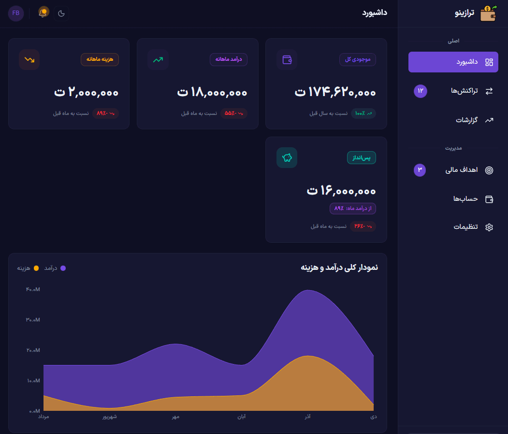

# 💰 Financer — Personal Finance Management App

Financer is a modern and fully localized personal finance management application built with **Next.js** and **TypeScript**.

It helps users track income and expenses, analyze spending patterns, and view clear monthly & yearly reports — with full **Persian (RTL)** support and **Jalali calendar** integration.

🌐 **Live Demo:**  
https://finance-tracker-psi-five.vercel.app/

---

## ✨ Features

- Track **income & expenses** with categories
- **Monthly & yearly** financial reports
- Interactive **charts & analytics**
- **Jalali (Persian) calendar**
- Full **RTL (Persian-first) UI**
- **Dark / Light** theme support
- Smooth animations with **Framer Motion**
- Notifications & feedback system
- Guest / Demo mode (no account required)

> 🚧 Import / Export & data deletion are planned for future releases (v2).

---

## 🛠️ Tech Stack

- **Framework:** Next.js (App Router)
- **Language:** TypeScript
- **Styling:** Tailwind CSS + shadcn/ui
- **State Management:** Zustand
- **Server State:** TanStack React Query
- **Authentication:** Clerk
- **Database:** PostgreSQL (Supabase)
- **ORM:** Prisma
- **Charts:** Recharts
- **Animations:** Framer Motion

---

## 📸 Screenshots



---

## 🚀 Getting Started (Local)

```bash
git clone https://github.com/your-username/finance-tracker.git
cd finance-tracker

npm install
npm run dev
```
